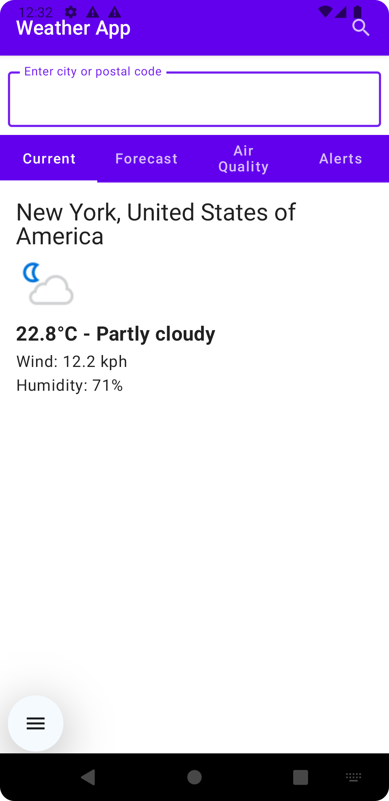
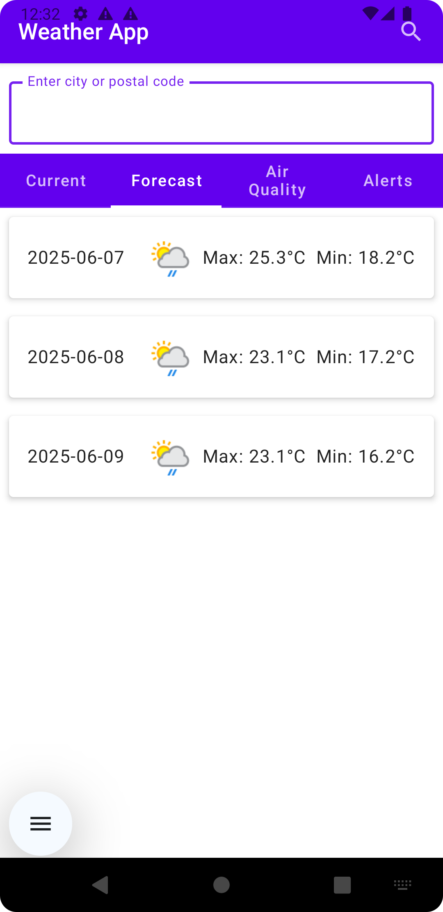
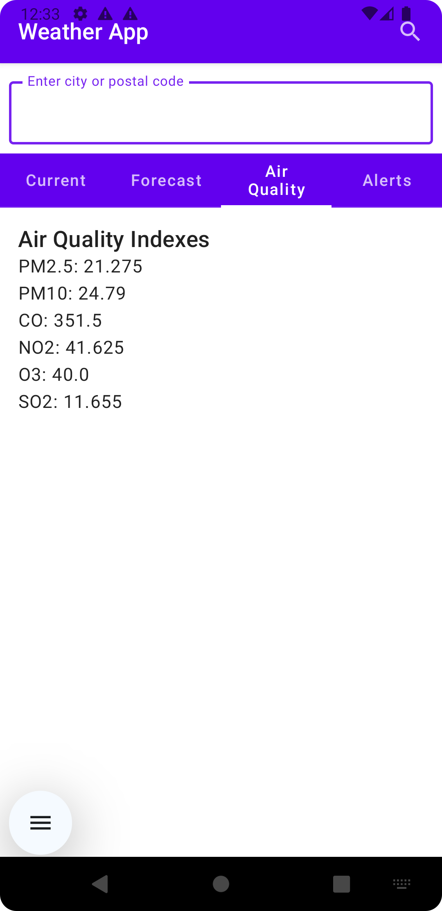
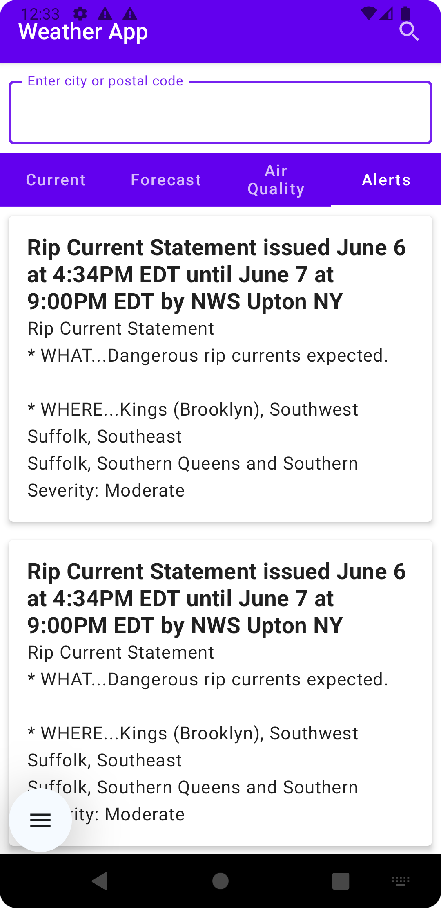

# Weather App - Kotlin | Jetpack Compose | Retrofit | Hilt

A modern Weather App built with **Kotlin** using **Jetpack Compose** for UI, **Retrofit** + **Gson** for API integration, and **Hilt** for dependency injection. This app integrates with [WeatherAPI.com](https://www.weatherapi.com/) to provide real-time weather data, forecasts, air quality information, alerts, and more.

---

## 🚀 Features

- **Real-time Weather Data:** Current temperature, conditions, wind speed, humidity for searched cities or GPS location.
- **Weather Forecast:** 1-day, 3-day, or 7-day forecasts with detailed daily summaries.
- **Historical Weather:** Retrieve past weather by date and city.
- **Weather Alerts:** Display official weather alerts if available for a region.
- **Air Quality Data:** Air quality indexes such as PM2.5, CO, NO2, O3, SO2, PM10 and EPA AQI indices.
- **Autocomplete City Search:** Search location suggestions powered by WeatherAPI’s `/search.json` endpoint.
- **Geolocation Support:** Uses Google's Fused Location Provider API to detect user's current location (permission required).
- **Clean Jetpack Compose UI:** Tabbed interface for easy navigation between Current Weather, Forecast, Air Quality, and Alerts.
- **Error Handling:** Graceful handling of network issues and API limits.
- **Dependency Injection:** Using Hilt for easy and testable dependency management.
- **Offline Caching:** (Planned) Cache last successful responses for offline use using Room or Preferences.

---

## 📦 Technologies & Libraries

| Feature                      | Library / API                     |
|-----------------------------|---------------------------------|
| Programming Language         | Kotlin                          |
| UI Framework                | Jetpack Compose                 |
| Networking                 | Retrofit + Gson Converter         |
| Dependency Injection         | Hilt                           |
| Async & Reactive Streams     | Kotlin Coroutines & Flow        |
| Location Services            | Google Fused Location Provider  |
| Image Loading               | Coil                           |
| Data Caching (Optional)       | Room (SQLite ORM) or Preferences|
| Weather API                 | [WeatherAPI.com](https://www.weatherapi.com/) |
| Navigation                  | Jetpack Navigation Compose      |

---

## 🔧 Project Setup

### 1. Clone the repository

```bash
git clone https://github.com/yourusername/weatherapp.git
cd weatherapp
```

### 2. Obtain API Key from WeatherAPI.com

**Sign up at WeatherAPI.com**
**Navigate to your dashboard and get the API key.**

### 3. Configure API Key

**Open the build.gradle.kts file in the root of your project (create if not exists).
Add your API key as:**
```bash
buildConfigField("String", "weatherApiKey", "\"YOUR_API_KEY_HERE\"")
```
### 4. Build & Run

Open the project in Android Studio Arctic Fox or newer.
Sync Gradle to download dependencies.
Run the app on an emulator or physical device (ensure location permissions granted if using geolocation).

### 📡 WeatherAPI.com Integration

The app primarily uses the following WeatherAPI endpoints:

| Endpoint | Purpose | |---------------------------|------------------------------------| | /forecast.json | Retrieves current weather + forecast days + air quality + alerts | | /search.json | Provides autocomplete suggestions for city search | | /history.json | Fetches historical weather data for a specific date and location |

Queries can be made with city names or latitude/longitude strings ("lat,lon").

Example call:
```
https://api.weatherapi.com/v1/forecast.json?key=YOUR_API_KEY&q=London&days=3&aqi=yes&alerts=yes
```

### 🔍 How the App Works

**Search Bar:** Users can search any city. The app presents autocomplete suggestions as you type.
**Weather Data:** Upon selecting or entering a location, the app fetches the current weather data plus forecast, air quality, and alerts from WeatherAPI.
**Navigation Tabs:** Separate tabs let users view:
**Current:** Temperature, wind, humidity, weather condition & icon.
**Forecast:** Daily forecast cards for up to 7 days (configurable).
**Air Quality:** PM2.5, CO, NO2, and other pollution indicators.
**Alerts:** Any active weather alerts for the searched area.
**Geolocation:** On app launch (if permitted), the app can detect the user's location to show local weather.
**Error Handling:** Network or API-related errors are displayed to users with appropriate messages.
**Caching (Planned):** Last known good response can be cached and displayed offline for improved UX.

### 📱 Screenshots

<div style="display: flex; gap: 20px; margin-bottom: 20px;">
  
  
  
  
</div>